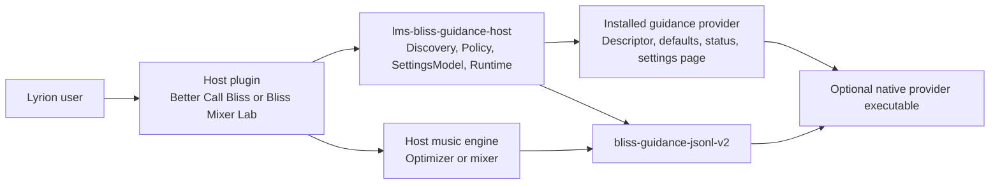
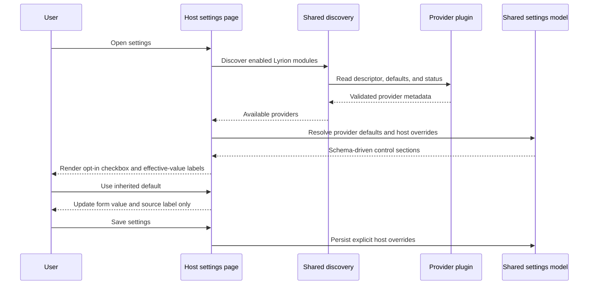
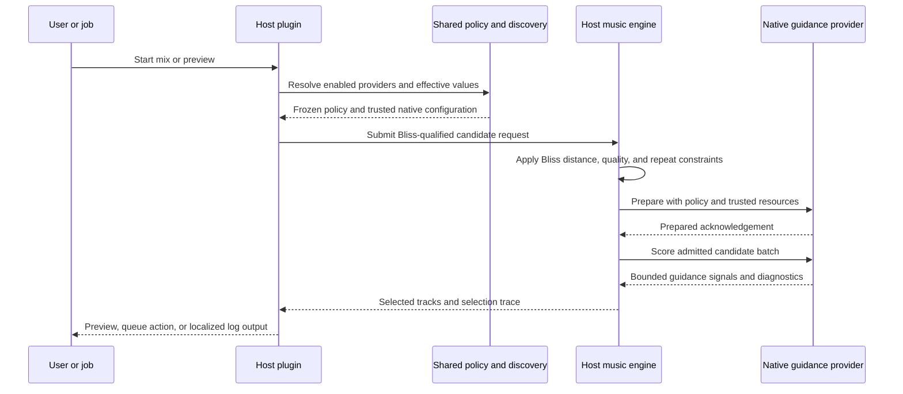

# Guidance-provider host architecture

`lms-bliss-guidance-host` is shared source code vendored by Lyrion host
plugins. It is deliberately not a plugin, does not own a settings page, and
does not choose music. Its role is to discover trusted provider plugins,
resolve their effective policy, render the canonical host controls, and run a
bounded native-provider session when a host requests one.

Guidance remains secondary. A host first narrows candidates with its normal
Bliss algorithm and constraints; a provider can then attach bounded signals to
those already-admitted candidates.

## Static architecture

The provider owns its default settings and backend configuration. The host
owns the opt-in switch and sparse per-host overrides. The shared library keeps
that boundary identical across host plugins.

## Discovery and settings flow

The browser-side controls only handle unsaved form state. Provider discovery,
policy resolution, and persistence stay in trusted Perl code.

## Runtime scoring flow

Provider failures are non-fatal: the host retains its Bliss-only result when a
provider is unavailable, invalid, slow, or returns unusable output.
