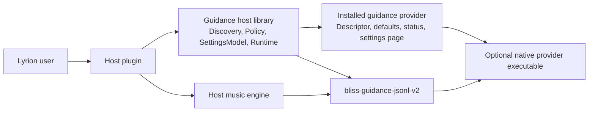
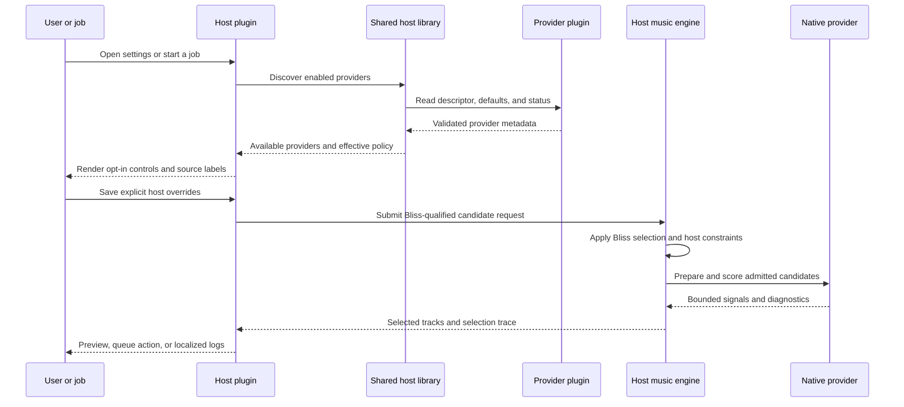

# lms-bliss-guidance-host

Shared, source-only Perl support for Lyrion plugins that consume discoverable
Bliss guidance providers. It is bundled by host plugins; it is not an
installable Lyrion extension and has no settings page of its own.

It provides provider discovery, host/default/job policy resolution, and a
bounded JSONL v2 native-provider session. Hosts remain Bliss-first: providers
receive only candidates the host has already admitted and can only contribute
secondary reranking signals.

## Architecture

The provider owns default settings and backend configuration. The host owns
the opt-in switch and sparse per-host overrides. The shared library keeps that
boundary consistent across hosts.

## Discovery, settings, and runtime flow

Selecting **Use inherited default** updates only the current form value and
source label; the ordinary Save action is the only persistence action.
Provider failures are non-fatal: a host retains its Bliss-only result when a
provider is unavailable, invalid, slow, or returns unusable output.

This repository is the authoritative consolidation target for shared
discovery, policy, and settings UI; it does not introduce a second provider
protocol. [Better Call Bliss](https://github.com/chrober/lms-better-call-bliss)
and [Bliss Mixer Lab](https://github.com/chrober/lms-blissmixer-lab) are current
examples of host plugins using this approach. See the
[`bliss-playlist-guidance-spi`](https://github.com/chrober/bliss-playlist-guidance-spi)
repository for the native protocol and provider contract.

The canonical settings-page contract is documented in
[Guidance-provider host settings UI](GUIDANCE_PROVIDER_HOST_UI.md).
